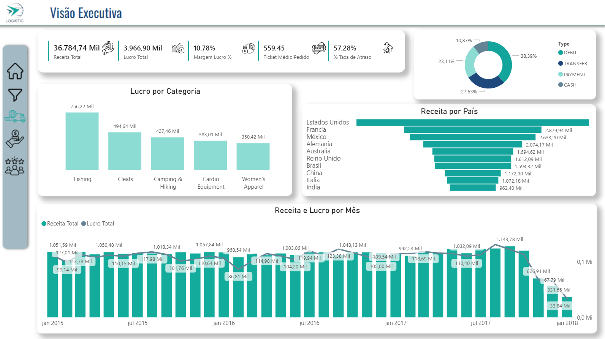
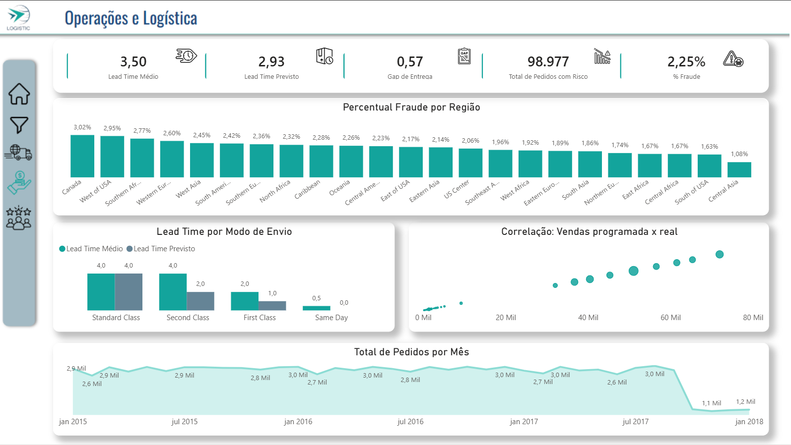
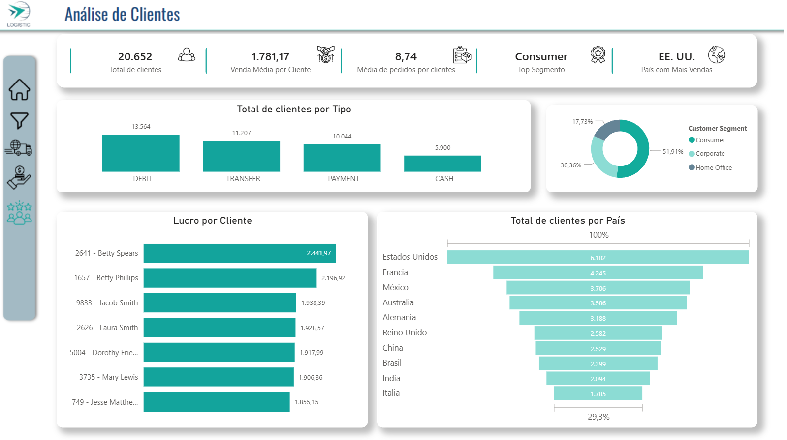

<h1>Supply Chain & Logistics Intelligence Dashboard</h1>

<h2>📋 Sumário</h2>

- [1. Visão Geral](#visao_geral)
- [2. Tecnologias e Conceitos Utilizados](#tecnologias)
- [3. Arquitetura de dados e ETL](#arquitetura)
- [4. Métricas e Insights](#metricas)
    - [4.1. Tela 1: Visão Executiva (Strategic Overview)](#tela1)
    - [4.2. Tela 2: Operações e Logística (Operational Efficiency)](#tela2)
    - [4.3. Tela 3: Customer Insights (Behavioral Analytics)](#tela3)
- [5. Diferenciais de UI/UX (Design)](#design)

<h2 id="visao_geral">1. Visão Geral</h2>

A operação sofria com a assimetria de informações entre as pontas da cadeia. O setor financeiro reportava receitas sem considerar o custo de oportunidade dos atrasos logísticos; a logística não tinha visibilidade sobre o impacto de fraudes no frete; e o marketing gerava rankings de clientes baseados em nomes duplicados, ignorando a identidade real (ID) dos consumidores. Isso resultava em decisões baseadas em dados ruidosos e perda de margem de lucro. Foi desenvolvido um ecossistema de Business Intelligence robusto, centralizado em um Modelo de Dados Relacional (Star Schema). A solução utiliza um pipeline de dados automatizado que unifica as visões estratégica, operacional e tática. O diferencial técnico reside na limpeza profunda via Power Query, que isolou variáveis de risco e normalizou a base de clientes, permitindo uma análise de lucratividade real por transação. O resultado foi a redução da incerteza operacional, permitindo que a gestão identifique instantaneamente onde o lucro está sendo drenado por ineficiência logística ou fraudes de pagamento, protegendo o EBITDA e otimizando o fluxo de caixa.

<h2 id="tecnologias">2. Tecnologias e Conceitos Utilizados</h2>

<ul>
    <li>Power BI Desktop</li>
    <li>ETL: Power Query (M) com parametrização de diretórios.</li>
    <li>DAX para métricas de inteligência de negócio.</li>
    <li>UX/UI: Dashboards de alta fidelidade com painéis de filtros sincronizados e navegação entre telas.</li>
    
</ul>

<h2 id="arquitetura">3. Arquitetura de Dados & ETL</h2>

´´´m
let
    fxTrataArquivos = (arquivo as binary, colunasData as list, colunasCom_ as list) as table =>
    let
        arquivoExcel = Excel.Workbook(arquivo, true){[Name="Sheet1"]}[Data],
        converteData = Table.TransformColumns(arquivoExcel, 
                                                List.Transform(colunasData, (c) => {c, each try DateTime.FromText(_,"en-US") otherwise null, type datetime})
                                                ),
        substitui_ = Table.ReplaceValue(converteData,"_"," ",Replacer.ReplaceText,colunasCom_)
    in
        substitui_,

    colunasCom_ = {"Order Status"},
    colunasData = {"order date (DateOrders)","shipping date (DateOrders)"},

    Fonte = Folder.Contents("coloque_o_caminho_onde_esta_a_pasta\supply_chain_analytics")
        {[Name="Logística"]}[Content]
        {[Name="meses"]}[Content],
    tabelasTratadas = Table.TransformColumns(Fonte,{{"Content", each fxTrataArquivos(_, colunasData, colunasCom_), type table}}),
    combinaTabelas = Table.Combine(tabelasTratadas[Content]),
    TipoAlterado = Table.TransformColumnTypes(combinaTabelas,{{"Type", type text}, {"Days for shipping (real)", Int64.Type}, {"Days for shipment (scheduled)", Int64.Type}, {"Benefit per order", type number}, {"Sales per customer", type number}, {"Delivery Status", type text}, {"Late_delivery_risk", Int64.Type}, {"Category Id", Int64.Type}, {"Category Name", type text}, {"Customer City", type text}, {"Customer Country", type text}, {"Customer Email", type text}, {"Customer Fname", type text}, {"Customer Id", Int64.Type}, {"Customer Lname", type text}, {"Customer Password", type text}, {"Customer Segment", type text}, {"Customer State", type text}, {"Customer Street", type text}, {"Customer Zipcode", Int64.Type}, {"Department Id", Int64.Type}, {"Department Name", type text}, {"Latitude", type number}, {"Longitude", type number}, {"Market", type text}, {"Order City", type text}, {"Order Country", type text}, {"Order Customer Id", Int64.Type}, {"order date (DateOrders)", type date}, {"Order Id", Int64.Type}, {"Order Item Cardprod Id", Int64.Type}, {"Order Item Discount", type number}, {"Order Item Discount Rate", type number}, {"Order Item Id", Int64.Type}, {"Order Item Product Price", type number}, {"Order Item Profit Ratio", type number}, {"Order Item Quantity", Int64.Type}, {"Sales", type number}, {"Order Item Total", type number}, {"Order Profit Per Order", type number}, {"Order Region", type text}, {"Order State", type text}, {"Order Status", type text}, {"Order Zipcode", Int64.Type}, {"Product Card Id", Int64.Type}, {"Product Category Id", Int64.Type}, {"Product Description", type any}, {"Product Image", type text}, {"Product Name", type text}, {"Product Price", type number}, {"Product Status", Int64.Type}, {"shipping date (DateOrders)", type datetime}, {"Shipping Mode", type text}})
in
    TipoAlterado

´´´

A extração foi projetada para simular um ambiente de Data Lake/SharePoint. O código em Linguagem M não apenas carrega dados, mas executa uma governança rigorosa:
<ul>
    <li>Dinamismo de Fonte (Folder.Files): O código utiliza funções de filtragem de metadados para varrer diretórios e consolidar arquivos de forma dinâmica. Isso garante que, ao adicionar novos períodos de vendas na pasta, o modelo se auto-atualize sem intervenção humana.</li>
    <li>Normalização de Entidades: Foi aplicada uma lógica de transformação para concatenar Customer_ID e Customer_Name. Isso resolve o problema de integridade onde o mesmo nome poderia representar clientes diferentes, garantindo que o cálculo de LTV (Lifetime Value) não seja inflado ou subestimado.</li>
    <li>Otimização de Tipagem: A tipagem é forçada no nível do Power Query (Int64.Type, Currency.Type). Isso otimiza o motor de compressão VertiPaq do Power BI, reduzindo o consumo de memória e acelerando o tempo de resposta dos filtros.</li>
</ul>

<h2 id="metricas">4. Métricas e Insights</h2>
<h3 id="tela1">4.1. Tela 1: Visão Executiva (Strategic Overview)</h3>

  

<ul>
    <li><strong color="#718096">Receita Bruta (Total Revenue):</strong> O valor total faturado sem deduções. Serve como o termômetro de volume de mercado.</li>
    <li><strong color="#718096">Margem de Lucro (Profit Margin):</strong> O percentual que sobra após todos os custos operacionais e de produto. É o indicador real de saúde do negócio.</li>
    <li><strong color="#718096">Ticket Médio (Average Order Value):</strong> O valor médio gasto por pedido. Ajuda a entender se a estratégia de vendas está focada em volume (muitos pedidos baratos) ou valor (poucos pedidos caros).</li>
    <li><strong color="#718096">Insight:</strong> O cruzamento dessas métricas revelou que as regiões com maior faturamento não eram necessariamente as mais lucrativas, devido a custos operacionais elevados, direcionando o foco para a eficiência e não apenas para a venda.</li>
</ul>

<h3 id="tela2">4.2. Tela 2: Operações e Logística (Operational Efficiency)</h3>

  

<ul>
    <li><strong color="#718096">Lead Time Médio:</strong> O tempo total decorrido desde o momento do pedido até a entrega final ao cliente. Mede a agilidade da cadeia.</li>
    <li><strong color="#718096">Gap de Entrega (Delivery Deviation):</strong> A diferença entre o prazo de entrega prometido (Scheduled) e o prazo real (Real). Se o gap é positivo, a empresa está atrasando; se negativo, está antecipando.</li>
    <li><strong color="#718096">Status de Fraude (Suspected Fraud):</strong> Pedidos bloqueados por critérios de risco. Mede o impacto das perdas evitadas ou prejuízos por transações ilegítimas.</li>
    <li><strong color="#718096">Insight:</strong> A análise detectou que o modo de envio "Standard Class" possuía o maior Gap de Entrega em regiões específicas, sugerindo a necessidade de renegociar contratos com as transportadoras locais dessas rotas.</li>
</ul>

<h3 id="tela3">4.3. Tela 3: Customer Insights (Behavioral Analytics)</h3>

  

<ul>
    <li><strong color="#718096">LTV (Lifetime Value):</strong> O valor total que um cliente gerou em lucro durante todo o seu histórico com a empresa. Indica quem são os clientes mais valiosos a longo prazo.</li>
    <li><strong color="#718096">Frequência de Compra:</strong> O número médio de vezes que um cliente retorna para comprar. Essencial para medir a fidelização.</li>
    <li><strong color="#718096">Segmentação de Mercado:</strong> Quebra dos clientes em grupos (Consumer, Corporate, Home Office) para entender qual perfil tem o melhor comportamento de pagamento.</li>
    <li><strong color="#718096">Insight:</strong> Descobriu-se que o segmento Corporate, apesar de ter uma frequência menor de pedidos, possui o maior LTV e a menor taxa de atraso de pagamento, sendo o público ideal para campanhas de expansão.</li>
</ul>

<h2 id="design">5. Diferenciais de UI/UX (Design)</h2>

<strong color="#718096">Design Minimalista:</strong> Uso de tons de Azul Marinho e Teal (Verde Água), baseados na identidade visual da marca.

<strong color="#718096">Navegação Intuitiva:</strong> Menu lateral para alternância de telas e botão para "Limpar Filtros".

<strong color="#718096">Alta Performance:</strong> Visual limpo com poucos elementos pesados, garantindo carregamento rápido.

